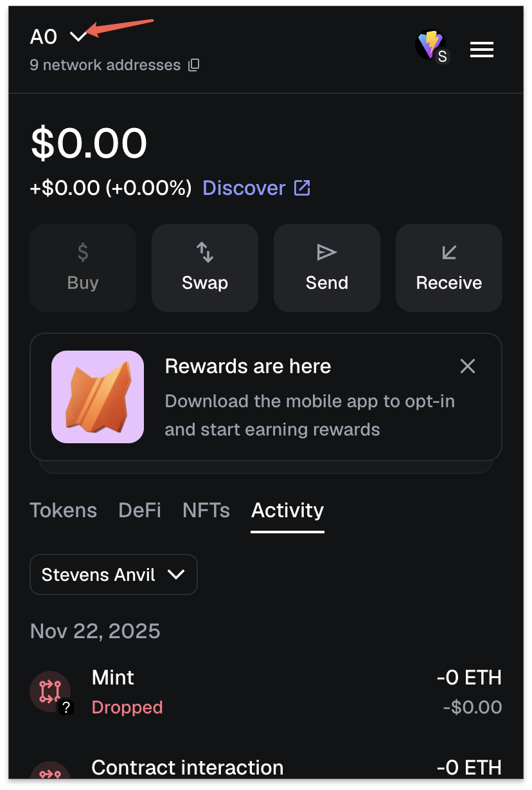
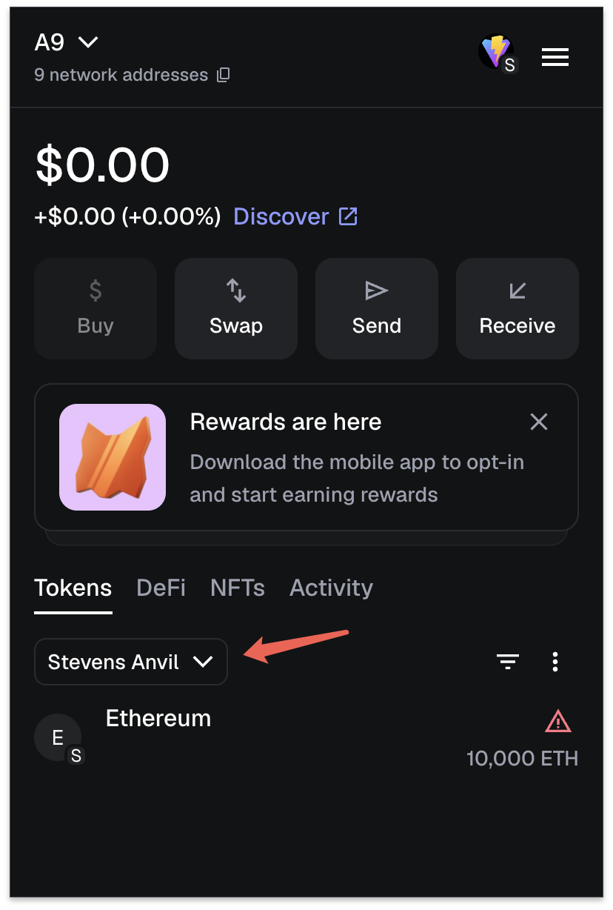

# MetaMask + Anvil Setup Guide

This guide shows how to connect MetaMask to your local Anvil blockchain and access the Stevens Banana Coin website.

---

## 🦊 What is MetaMask?

MetaMask is a crypto wallet that allows you to manage accounts, sign transactions, and connect to blockchain apps directly from your browser.

---

## ⚙️ What is Anvil?

**Anvil** is a local Ethereum blockchain simulator from Foundry.  
It gives you:

- Local test accounts  
- Private keys  
- Automatic mining  
- Instant transactions  

Your website interacts with this local blockchain through RPC.

---

## 🌐 How Everything Connects

```
MetaMask  <──>  Anvil (local blockchain)  <──>  SBC Website (http://your-ip:5173)
```

MetaMask = Wallet  
Anvil = Blockchain  
Website = Front-end that sends transactions

---

## 🧩 Step 1 — Import an Anvil Account into MetaMask

1. Open MetaMask  
2. Click the **top-left account label**  
3. Scroll down and select **Add account or hardware wallet**  
4. Click **Import account**  
5. Paste your Anvil private key  
6. Click **Import**

### Account Menu


### Imported Account


---

## 🌐 Step 2 — Add Anvil as a Custom Network

In MetaMask:

1. Click the **network selector** (top-right dropdown)  
2. Click **Add network** → **Add a network manually**  
3. Enter the following:

```
Network Name: Stevens Anvil
RPC URL: http://10.246.103.99:8545/
Chain ID: 31337
Currency Symbol: ETH
Block Explorer URL: (leave blank)
```

---

## 🌐 Step 3 — Open the Frontend Website

Open your browser and go to:

```
http://10.246.103.99:5173/
```

MetaMask will now automatically detect:
- Your imported wallet  
- Your Anvil network  
- Your deployed SBC smart contract  

You're ready to test! 🚀

---

## ✅ Finished!

Your MetaMask is now connected to your local blockchain and can interact fully with your SBC project.

